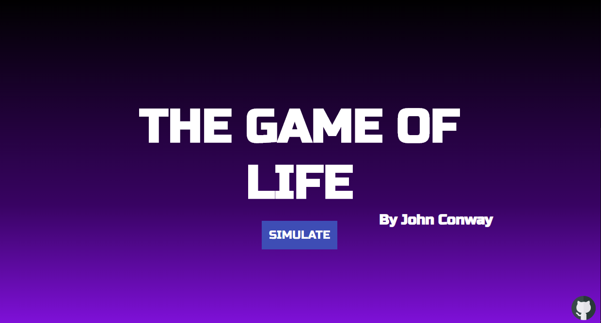

# Conway's Game of Life

<a href='https://conways-game-of-life-meep-morp.vercel.app/'>DEPLOYED WEBPAGE</a>

 

## Third Party Libraries Used

- <a href='https://github.com/immerjs/immer'>Immer JS</a>
    
Makes changing state a lot easier 

- <a href='https://reactrouter.com/web/guides/quick-start'>React Router Dom</a>
    
Single Page Applications in React

## References

- <a href='https://www.youtube.com/watch?v=DvVt11mPuM0&t=1479s'>The Game of Life
  in React</a>
- <a href='https://dribbble.com/meepmorpp/collections/3189918-Game-of-Life-Inspirations'>Dribble
  Folder with UI inspiration</a>
